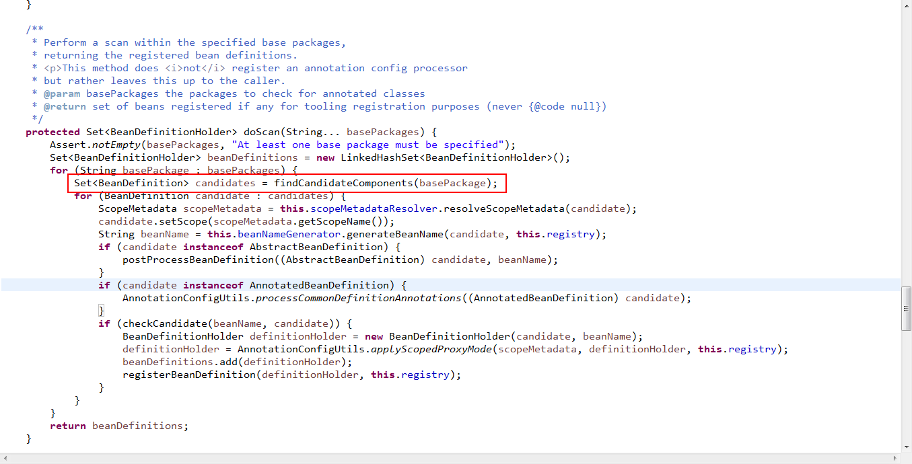
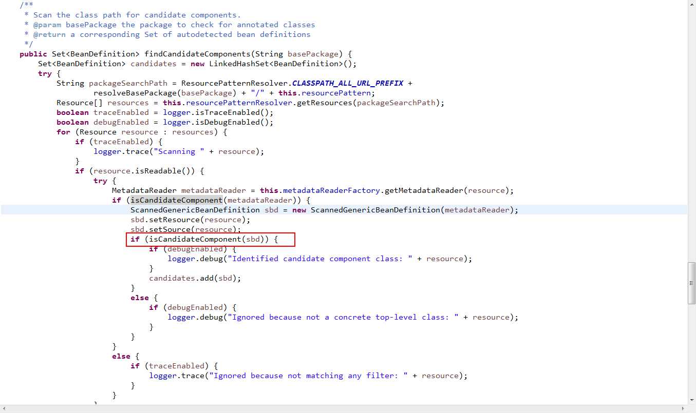
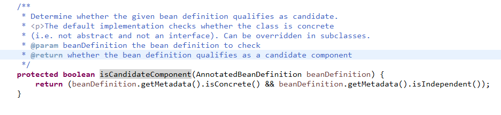
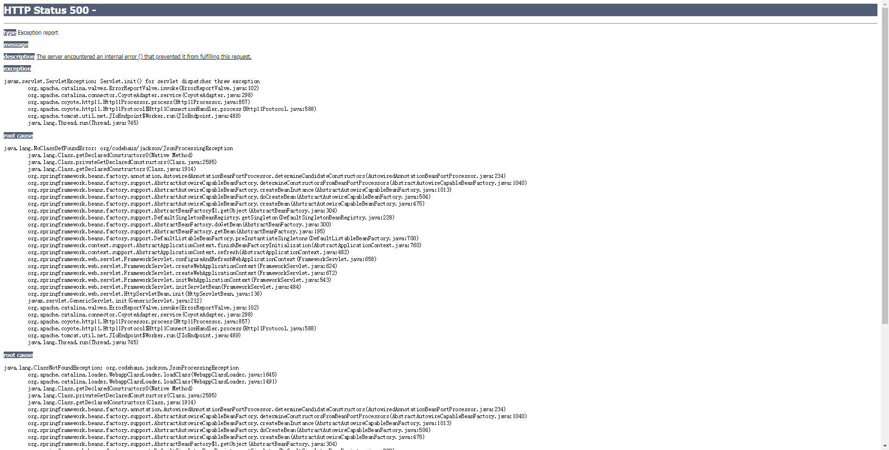

# SpringMVC学习
## 认识org.springframework.web.servlet.DispatcherServlet
参考[DispatcherServlet](http://sishuok.com/forum/blogPost/list/5188.html)  
在web.xml中的配置
```xml
<servlet>
        <servlet-name>chapter2</servlet-name>
        <servlet-class>org.springframework.web.servlet.DispatcherServlet</servlet-class>
        <load-on-startup>1</load-on-startup>
    </servlet>
    <servlet-mapping>
        <servlet-name>chapter2</servlet-name>
        <url-pattern>/</url-pattern>
    </servlet-mapping>
```
load-on-startup：表示启动容器时初始化该Servlet；  
url-pattern：表示哪些请求交给Spring Web MVC处理， “/” 是用来定义默认servlet映射的。也可以如“*.html”表示拦截所有以html为扩展名的请求。    

 可选参数   | 解释 
------------- | ------------- 
contextClass  | 任意实现了WebApplicationContext接口的类。这个类会初始化该servlet所需要用到的上下文对旬。默认情况下，框架会使用一个XmlWebApplicationContext对象 
contextConfigLocation  | 一个指定了上下文配置路径的字符串，该值会被传入给contextClass所指定的上下文实例对象。文具字符串内可以包含多个字符串，字符串这间以逗号分隔，以此支持你进行多个上下文的配置。在多个上下文中重复定义的bean，以最后加载的bean定义为准 
namespace  | WebApplicationContext的命名空间。默认是[servlet-name]-servlet   
----------
在项目中就有两种使用情况contextConfigLocation和namespace  
>
```xml
<!--下面这段配置负责初始化Root WebApplicationContext-->
<servlet>
  <servlet-name>dispatcher</servlet-name>
  <servlet-class>org.springframework.web.servlet.DispatcherServlet</servlet-class>
  <init-param>
   <param-name>contextConfigLocation</param-name>
   <param-value>classpath:/spring-mvc.xml</param-value>
  </init-param>
 </servlet>
 
 <!--下面这段配置负责初始化Servlet WebApplication-->
 <servlet>
  	<servlet-name>hessian</servlet-name>
  	<servlet-class>org.springframework.web.servlet.DispatcherServlet</servlet-class>
  	<init-param>
	   <param-name>namespace</param-name>
	   <param-value>classpath:/hessian-servlet</param-value>
	  </init-param>
	  <load-on-startup>1</load-on-startup>
  </servlet>
  <servlet-mapping>
  	<servlet-name>hessian</servlet-name>
  	<url-pattern>/hessian/*</url-pattern>
  </servlet-mapping>
```
namespace 与contextConfigLocation的区别:namespace指定的文件，spring-mvc 会去WEB-INF/上去寻找，不用加后缀;contextConfigLocation可以指定多个配置文件，用逗号分开。   
参考[DispatcherServlet 参数 namespace contextConfigLocatoin区别]（https://blog.csdn.net/weixin_36210698/article/details/72629259）

## 认识org.springframework.beans.factory.support.BeanDefinitionRegistryPostProcessor
参考[Spring生成bean的过程](http://blog.gavinzh.com/2017/11/17/Spring-create-bean/)
参考[Spring扩展点总结](http://blog.gavinzh.com/2017/11/20/spring-develop-summary/)
## 认识org.springframework.context.annotation.ClassPathBeanDefinitionScanner
参考[Spring扫描basePackages注解](https://blog.csdn.net/unix21/article/details/52163789)
参考[动态注入接口Bean](https://blog.csdn.net/geekjoker/article/details/80497913)
在spring容器对注解的解析过程中，此类将会扫描。
```xml
<context:component-scan base-package="com.jiang.web.controller"></context:component-scan>
```
这样就会调用ClassPathBeanDefinitionScanner的doScan方法。  

其中红线部分是其父类方法org.springframework.context.annotation.ClasPathScanningCandidateComponentProvider.findCandidateComponents(String),通过该方法来查找组件.  

其中红线部分方法org.springframework.context.annotation.ClassPathScanningCandidateComponentProvider.isCandidateComponent(AnnotatedBeanDefinition)，是对bean定义的一个过滤。源码如下图  

 原方法这里是判断是否为顶级类和是否是依赖类（即接口会被排除掉-由于我们需要将接口加进来，所以需要覆盖该方法）。可是现在我项目里扫描的是接口，所以需要重写这个方法。  
其父类ClassPathScanningCandidateComponentProvider里有两个属性 。参考[ClassPathScanningCandidateComponentProvider](https://blog.csdn.net/duzm200542901104/article/details/78909668) 
```java
private finalList<TypeFilter>includeFilters=newLinkedList<TypeFilter>();
private finalList<TypeFilter>excludeFilters=newLinkedList<TypeFilter>();
```
一个是包含的过滤器，一个是排除的过滤器，在扫描的时候，首先进行排除过滤器的匹配，如果匹配了结果集中就不包含此类，否则继续包含过滤器的匹配，如果匹配了就包含此类。  
ClassPathScanningCandidateComponentProvider里的源码resetFilters方法正是设置这两个值的。如下：
```java
/**
	 * Reset the configured type filters.
	 * @param useDefaultFilters whether to re-register the default filters for
	 * the {@link Component @Component}, {@link Repository @Repository},
	 * {@link Service @Service}, and {@link Controller @Controller}
	 * stereotype annotations
	 * @see #registerDefaultFilters()
	 */
	public void resetFilters(boolean useDefaultFilters) {
		this.includeFilters.clear();
		this.excludeFilters.clear();
		if (useDefaultFilters) {
			registerDefaultFilters();
		}
	}
```

## 认识org.springframework.beans.factory.annotation.AnnotatedBeanDefinition
## 认识org.springframework.beans.factory.InitializingBean
InitializingBean接口为bean提供了初始化方法的方式，它只包括afterPropertiesSet方法，凡是继承该接口的类，在初始化bean的时候会执行该方法。  
参考[InitializingBean的作用](https://blog.csdn.net/maclaren001/article/details/37039749)
## 认识org.springframework.web.context.support.XmlWebApplicationContext
从XML配置文件中装配的，用于WEB环境的ApplicationContext实现类，派生于 {@link org.springframework.web.context.support.XmlWebApplicationContext}。  
- getParentBeanFactory()获取父容器bean工厂
- getAutowireCapableBeanFactory 获取一个注册了bean的集合工厂

## 认识org.springframework.beans.factory.support.DefaultListableBeanFactory
参考[spring beans源码解读之 ioc容器之始祖--DefaultListableBeanFactory](https://www.cnblogs.com/davidwang456/p/4187012.html)  
（自己的理解）封装spring容器中已经注册好的bean的集合类。
- 继承自AbstractAutowireCapableBeanFactory的方法  

>提供bean的创建 (有construct方法), 属性注值, 绑定 (包括自动绑定)和初始化.处理运行时bean引用, 解析管理的集合, 调用初始化方法。

## 认识org.springframework.aop.support.AopUtils
这就是spring的一个工具类：
>public static Class<?> getTargetClass(Object candidate)这个方法是通过Aop的代理查找到目标类（即真正执行逻辑的类）。  
参考[getTargetClass说明和使用](http://norther.iteye.com/blog/269763)

## 认识org.springframework.beans.factory.config.RuntimeBeanReference.RuntimeBeanReference(String)
参考[Spring Bean的解析 RuntimeBeanReference](https://blog.csdn.net/jerryai1/article/details/52980239)  
在Spring中，Bean的解析阶段，会把xml配制中的<bean>标签解析成Spring中的BeanDefinition对像，我们知道一个bean可能需要依赖其他的bean，在XML配置中可以表现为  
```xml
<bean class="foo.bar.xxx">
   <property name="referBeanName" ref="otherBeanName" />
</bean>
```
在Spring的解析段，其实容器中是没有依赖的Bean的实例的因此，那么这是这个被依赖的Bean如何在BeanDefinition中表示呢？  
答案就是RuntimeBeanReference，在解析到依赖的Bean的时侯，解析器会依据依赖bean的name创建一个RuntimeBeanReference对像，将这个对像放入BeanDefinition的MutablePropertyValues中。  
例如：上例中的依赖bean会被解析成  
```java
//我们知道foo.bar.xxx 被解析为一个beanDefiniton，假设为xxxBeanDefinition
reference = new RuntimeBeanReference("otherBeanName");
xxxBeanDefinition.getPropertyValues().addPropertyValue("referBeanName", reference);
```
## 认识org.springframework.beans.factory.annotation.AnnotatedBeanDefinition
参考[AnnotatedBeanDefinition](https://www.cnblogs.com/davidwang456/p/4199459.html)  
AnnotationMetadata里部分方法说明：   
boolean isInterface()返回该类是否是接口。  
boolean isAbstract()返回该类是否为抽象类。  
boolean isConcrete()返回该类是否为具体类。  
boolean isFinal()返回该类是否为final类。  
为什么堵堵没有项目中使用的beanDefinition.getMetadata().isIndependent()   
## 认识org.springframework.web.context.ContextLoaderListener  
参考[Spring的初始化：org.springframework.web.context.ContextLoaderListener](https://www.cnblogs.com/wuchaodzxx/p/6038895.html)  
在web.xml中配置：  
```xml
<listener>
 	<listener-class>org.springframework.web.context.ContextLoaderListener</listener-class>
 </listener>
```
ContextLoaderListener的作用就是启动Web容器时，自动装配ApplicationContext.xml的配置信息。因为它实现了ServletContextListener这个接口，在web.xml配置这个监听器，启动容器时，就会默认执行它实现的方法    
## 认识org.springframework.context.ApplicationContextAware  
参考[org.springframework.context.ApplicationContextAware使用理解](https://www.cnblogs.com/McCa/p/5920865.html)  
当一个类实现了这个接口（ApplicationContextAware）之后，这个类就可以方便获得ApplicationContext中的所有bean。换句话说，就是这个类可以直接获取spring配置文件中，所有有引用到的bean对象。  
1.SpringMVC环境的搭建  
    
    > 1.1  在web.xml文件里进行配置.  
	```xml
	 <servlet>
	  <servlet-name>dispatcher</servlet-name>
	  <servlet-class>org.springframework.web.servlet.DispatcherServlet</servlet-class>
	  <init-param>
	   <param-name>contextConfigLocation</param-name>
	   <param-value>classpath:/spring-mvc.xml</param-value>
	  </init-param>
	 </servlet>
	 <servlet-mapping>
	  <servlet-name>dispatcher</servlet-name>
	  <url-pattern>*.do</url-pattern>
	 </servlet-mapping>
	```
	
	>1.2  在spring-mvc.xml里配置。  
	>> 1.2.1 需要spring扫描的包（一般是controller了）。  
	<context:component-scan base-package="com.jiang.web.controller"></context:component-scan>  
	>> 1.2.2 其它一些配置信息.  
	```xml
	<!--避免IE执行AJAX时，返回JSON出现下载文件 -->
	 <bean id="mappingJacksonHttpMessageConverter"
	  class="org.springframework.http.converter.json.MappingJacksonHttpMessageConverter">
	  <property name="supportedMediaTypes">
	   <list>
	    <value>text/html;charset=UTF-8</value>
	   </list>
	  </property>
	 </bean>
	 <!-- 启动SpringMVC的注解功能，完成请求和注解POJO的映射 -->
	 <bean
	  class="org.springframework.web.servlet.mvc.annotation.AnnotationMethodHandlerAdapter">
	  <property name="messageConverters">
	   <list>
	    <ref bean="mappingJacksonHttpMessageConverter" /> <!-- JSON转换器 -->
	   </list>
	  </property>
	 </bean>
	 <!-- 定义跳转的文件的前后缀 ，视图模式配置-->
	 <bean class="org.springframework.web.servlet.view.InternalResourceViewResolver">
	  <!-- 这里的配置我的理解是自动给后面action的方法return的字符串加上前缀和后缀，变成一个 可用的url地址 -->
	  <property name="prefix" value="/WEB-INF/jsp/" />
	  <property name="suffix" value=".jsp" />
	 </bean>
	```  
	> 1.3 编写Controller的java类.  
	````java
	package com.jiang.web.controller;

		import org.springframework.beans.factory.annotation.Autowired;
		import org.springframework.stereotype.Controller;
		import org.springframework.web.bind.annotation.RequestMapping;
		import org.springframework.web.bind.annotation.ResponseBody;
		
		import com.jiang.service.UserService;
		
		@Controller
		@RequestMapping(value="/")
		public class TestControll {
		
			@Autowired
			private UserService userService;
			
			@RequestMapping(value="testVisit")
			@ResponseBody
			public String testVisit(){
				userService.login();
				return "accountBook_server activty";
			}
		}
	
	``` 
	> 1.4 启动容器,在浏览器输入地址即可.  
	
注意可能会出现  [注入bean失败的问题](#notBean)  
2.在搭建环境过程中，我使用了如下的配置：  
```xml
<!--避免IE执行AJAX时，返回JSON出现下载文件 -->
	 <bean id="mappingJacksonHttpMessageConverter"
	  class="org.springframework.http.converter.json.MappingJacksonHttpMessageConverter">
	  <property name="supportedMediaTypes">
	   <list>
	    <value>text/html;charset=UTF-8</value>
	   </list>
	  </property>
	 </bean>
	 <!-- 启动SpringMVC的注解功能，完成请求和注解POJO的映射 -->
	 <bean
	  class="org.springframework.web.servlet.mvc.annotation.AnnotationMethodHandlerAdapter">
	  <property name="messageConverters">
	   <list>
	    <ref bean="mappingJacksonHttpMessageConverter" /> <!-- JSON转换器 -->
	   </list>
	  </property>
	 </bean>
```
在访问我写的接口的Url的时候页面报错了（如下图）：  


原来是jar包没有引用，需要引用一下jar包：  
jackson-core-asl.jar和jackson-mapper-asl.jar，pom文件格式如下：  
```xml
<dependency>
	   <groupId>org.codehaus.jackson</groupId>
	   <artifactId>jackson-core-asl</artifactId>
	   <version>1.9.13</version>
	  </dependency>
	  <dependency>
	   <groupId>org.codehaus.jackson</groupId>
	   <artifactId>jackson-mapper-asl</artifactId>
	   <version>1.9.13</version>
	  </dependency>
``` 

# spring 与hessian的整合
## 服务端
1.在web.xml文件中配置hessian的过滤配置：  
```xml
<servlet>
  	<servlet-name>hessian</servlet-name>
  	<servlet-class>org.springframework.web.servlet.DispatcherServlet</servlet-class>
  	<init-param>
	   <param-name>namespace</param-name>
	   <param-value>classes/hessian-servlet</param-value>
	  </init-param>
	  <load-on-startup>1</load-on-startup>
  </servlet>
  <servlet-mapping>
  	<servlet-name>hessian</servlet-name>
  	<url-pattern>/hessian/*</url-pattern>
  </servlet-mapping>
```
2.hessian-servlet.xml的配置文件,这是一个自己写的对hessian提供服务的类,减去 了需要不停配置的繁琐.这里一个是需要指定的扫描包路径,另一个是我们自定义的注解(凡是需要提供服务的接口都要使用该注解)  
下面重點講解com.jiang.util.HessianServerScannerConfigurer类。这个类的实现接口如下：　　
```java
public class HessianServerScannerConfigurer implements BeanDefinitionRegistryPostProcessor, InitializingBean, BeanNameAware, ApplicationContextAware
```
该类实现了org.springframework.context.ApplicationContextAware.类会通过下面的方法，将spring应用上下文赋值给类属性applicationContext  
```java
@Override
	public void setApplicationContext( ApplicationContext applicationContext ) throws BeansException {

		this.applicationContext = applicationContext;
	}
```
可以看到实现了org.springframework.beans.factory.InitializingBean，InitializingBean接口为bean提供了初始化方法的方式，它只包括afterPropertiesSet方法，凡是继承该接口的类，在初始化bean的时候会执行该方法。所以spring容器在加载初始化这个bean的时候会先执行afterPropertiesSet方法。　　
com.jiang.util.HessianServerScannerConfigurer.afterPropertiesSet()这个方法逻辑是在spring容器的应用里找到被注入的bean，然后遍历bean,找到bean实现的接口集合，检查接口是否有我们自定义的注解。如果有就将该bean放入map里。  
该类实现了org.springframework.beans.factory.support.BeanDefinitionRegistryPostProcessor接口.接口里的postProcessBeanDefinitionRegistry方法可以修改在BeanDefinitionRegistry接口实现类中注册的任意BeanDefinition，也可以增加和删除BeanDefinition。原因是这个方法执行前所有常规的BeanDefinition已经被加载到BeanDefinitionRegistry接口实现类中，但还没有bean被实例化。  
com.jiang.util.HessianServerScannerConfigurer.postProcessBeanDefinitionRegistry(BeanDefinitionRegistry)这个方法里会有一个自定义的扫描类,  
```java
private class HessianClassPathScanner extends ClassPathBeanDefinitionScanner
```
HessianClassPathScanner类继承了org.springframework.context.annotation.ClassPathBeanDefinitionScanner类，我重写isCandidateComponent方法，因为默认的方法过滤了接口类型，而我这里需要的就是接口，所以重写了。  重写了doScan方法，遍历BeanDefinitionHolder集合,修改GenericBeanDefinition信息,使其成为hessian服务.
com.jiang.util.HessianServerScannerConfigurer.HessianClassPathScanner.registerFilters()，注册扫描时的一些过滤器，确保被正确的扫描。
3.编写接口服务和实现类（具体查看项目中的使用）
```xml
<bean class="com.jiang.util.HessianServerScannerConfigurer">
		<property name="basePackge" value="com.jiang.service"></property>
		<property name="annotationClass" value="com.jiang.util.Hession"></property>
	</bean>
```
## 客户端  
客户端只需要指定好url地址，根据com.caucho.hessian.client.HessianProxyFactory的create创建。可以参考项目中的
# spring问题  
- 在项目中编写了一个这样的类：  
参考[The type javax.servlet.ServletContext cannot be resolved. It is indirectly referenced from required](https://blog.csdn.net/lurao/article/details/50237253)
```java
package com.jiang.util;
import org.springframework.beans.factory.xml.XmlBeanDefinitionReader;
import org.springframework.web.context.support.XmlWebApplicationContext;

public class SpringContext extends XmlWebApplicationContext{
	private XmlBeanDefinitionReader beanDefinitionReader;

	@Override
	protected void initBeanDefinitionReader( XmlBeanDefinitionReader beanDefinitionReader ) {

		
		super.initBeanDefinitionReader( beanDefinitionReader );
		this.beanDefinitionReader=beanDefinitionReader;
			
	}

	
	public XmlBeanDefinitionReader getBeanDefinitionReader() {
	
		return beanDefinitionReader;
	}
	
}

```
编译器提示报错The type javax.servlet.ServletContext cannot be resolved. It is indirectly referenced from  	 required .class files，这是由于缺少servlet。  
引用下面的依赖就可以了:
```xml
<dependency>
	  	<groupId>javax</groupId>
	  	<artifactId>javaee-api</artifactId>
	  	<version>7.0</version>
	  </dependency>
```
<a name="notBean"></a>
- bean的注入问题  
在java中使用下面方式进行bean的注入
```java
@Autowired
	private UserService userService;
```
在请求是出错了，报注入失败

> org.springframework.beans.factory.BeanCreationException: Error creating bean with name 'testControll': Injection of autowired dependencies failed; nested exception is org.springframework.beans.factory.BeanCreationException: Could not autowire field: private com.jiang.service.UserService com.jiang.web.controller.TestControll.userService; nested exception is org.springframework.beans.factory.NoSuchBeanDefinitionException: No qualifying bean of type [com.jiang.service.UserService] found for dependency: expected at least 1 bean which qualifies as autowire candidate for this dependency. Dependency annotations: {@org.springframework.beans.factory.annotation.Autowired(required=true)}
	at org.springframework.beans.factory.annotation.AutowiredAnnotationBeanPostProcessor.postProcessPropertyValues(AutowiredAnnotationBeanPostProcessor.java:292)
	at org.springframework.beans.factory.support.AbstractAutowireCapableBeanFactory.populateBean(AbstractAutowireCapableBeanFactory.java:1185)
	
发现是自己没有对service.impl包下的实现类进行解析，所以在spring容器里没有这样的bean。于是我就在spring-mybatis,xml文件里添加扫描配置。如下：
```xml
<context:component-scan base-package="com.jiang.service.impl"></context:component-scan>
```	
然后就出现了，后面的问题。
- 在web.xml里配置了：
```xml
<context-param>
  	<param-name>contextConfigLocation</param-name>
  	<param-value>classpath:/spring-mybatis.xml</param-value>
  </context-param>
```
发现在启动应用的时候,spring容器没有去加载这个文件,当时好生奇怪.原来还要在.xml文件里加上spring的监听。如下：
```xml
<listener>
 	<listener-class>org.springframework.web.context.ContextLoaderListener</listener-class>
 </listener>
```